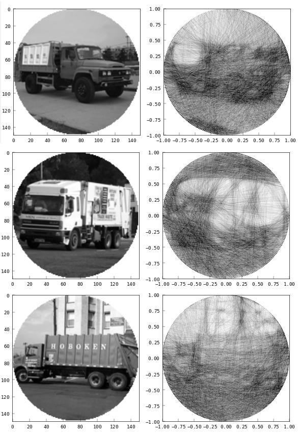

# Tangler

This project is inspired by physical [string art](https://vimeo.com/175653201), where you reproduce images using a sequence of overlapping strings.

The usual way to generate a pattern like that is with an incremental approach: start at some arbitrary pin, then add a single line at a time looking for the optimal next pin that gets your vector representation closer to the bitmap version. This works surprisingly well. I made a web app called [Raveler](https://jperryhouts.github.io/raveler/) that can convert any image into string art using that method.

That algorithm takes ~200 milliseconds in native C++, and I got it to around 600 milliseconds in the browser using a C++ to wasm/javascript compiler. I think it would be really cool to do this in real time with video or webcam input where 600ms per frame would be too slow. It seems like something a neural net would be really good at, since it's basically just a weird compression algorithm.

The goal of this project is to train a neural network that will be able to generate similar string art representations of arbitrary images in real time. My plan is to convert a bunch of random images into line paths using the iterative approach I mentioned before, and train a neural net to generate similar patterns, using the original bitmap images as examples.

## Challenges

This problem is not trivial, as the original algorithm is stochastic and quantized into discrete outputs (locations of pins around the circumference of the circle). Comparing the quality of one string path to another is challenging, and the fact that the problem is discretized means that there are no obvious derivatives that an iterative optimizer can follow to improve its results.

I’ve identified three basic approaches to handle this problem:

1. Match the exact pattern (e.g. pin 1, 10, 62, 76, 89, 1, ...).
    - This sort of works, but because the original algorithm is stochastic it doesn't do a very good job at generalizing. For instance, the above example would be exactly equivalent to traversing those  same nodes in the opposite direction. The original algorithm is highly sensitive to minor variations in the input, so it may very well take either route while the model has no way to know about that symmetry.
    - It isn’t good at comparing the similarity of two points, since it doesn’t know about the spatial wrap-around inherent in the problem -- pin K-1 is adjacent to pin 0 for a model with K pins. For instance, pin 1 is closer to pin 280 than it is to pin 150.
2. Encode the target pattern as a probability density with respect to the edges traversed, rather than the nodes. e.g. the above example would be encoded such that the edge between pin 1->10 is traversed once, as is the edge between 10->62, 62->76 etc. This allows the model to match string patterns independent of their particular ordering.
3. Some sort of recurrent network, where the sequence is built up incrementally, similar to the original algorithm.

I’m going to rule out approach 3 right away, because the whole point is to do the whole process in one-shot. Building a path incrementally is the starting point here, not the end goal. Approach 2 is more likely to generalize than approach 1, but it has several important drawbacks:

- It loses all information about the inherent symmetry and spatial layout of the problem. For instance, it can’t know that an edge from A-B is more similar to an edge from A-B+1 than A-B+100.
- It isn’t true to the original point of the exercise-- using one continuous string path.
- Rendering a few thousand separate lines is slower than rendering one long path
- The resulting model is big because it has O(K^2) output dimensions, where K is the number of pins around the circumference of the circle.

### Method

After much experimentation, the method I've adopted is based on the principle of solving for the probability distribution of each edge being "active", and sampling from that distribution at inference time. This is similar to approach 2 above, but with important modifications.

The crux of my solution comes down to the intermediate representation of that probability distribution. The naive approach is to encode the solution as an NxN matrix of edges, where N is the number of pins. Thus, a string from pin 17 to 42 would be represented as a 1 in row 17, column 42. The resulting matrix is very large and extremely sparse, and as mentioned above it loses information about the spatial symmetry in the problem.

Rather than solving for a sparse NxN matrix, I instead represent the training targets as matrices where rows correspond to individual pins, (e.g. row_i corresponds to pin_i), and columns contain a collection of pins to which pin_i connects. In order to create a differentiable loss function while avoiding the angular wrap-around problem I store the pin locations in cartesian coordinates, which splits the target into a rank 3 tensor with dimensions 2 x K x L where K is the number of pins, and L is the length of each row. **The loss function can then be any cartesian norm.**

Inference involves running an image through the network and extracting outputs from the layer before the radial to cartesian split. It's possible to just use the output as is, drawing a line from each pin to all of its connections, but this format also facilitates generating a continuous line path. Basically, just start from some arbitrary pin (say pin 0 for example), then pop a value off the front of row 0 and use that value as the next point in the path. Hop to that new row and pop its first value, and so on. There is always the possibility of returning to a pin more times than would have happened in the original, in which case the inference function will just punt to the next index. That corresponds to a situation where "there are no more good path options from this pin, so go try its neighbor".

This scheme only requires solving for the same number of output values as the actual length of the path I'm generating (O(N), where N is the number of lines in the resulting path), and is not sensitive to the order in which the lines appear in the training examples. It also preserves information about the spatial layout and inherent symmetry. I managed to construct a convolutional model with good convergence behavior.

<a href="https://raw.githubusercontent.com/jperryhouts/Tangler/main/docs/architecture.png">

</a>

## Data

I am currently using images from [Imagenette](https://github.com/fastai/imagenette), a subset of the Imagenet database. The labels are ignored, and targets are generated using the [Raveler](https://github.com/jperryhouts/raveler/) CLI app. Targets are then converted into the format described in the methods section above. For efficiency, a scaled and cropped grayscale version of each image is saved alongside its calculated target in a set of `.tfrecord` files.

All the preprocessing steps can be reproduced by installing [Raveler](https://github.com/jperryhouts/raveler/) and running Tangler in `prep` mode with the following options:

```
python3 tangler.py prep -r 150 -n 10 -J 4 -N 5000 -k 256 -c 60 imagenette/train tfrecords/train
python3 tangler.py prep -r 150 -n 10 -J 4 -N 5000 -k 256 -c 60 imagenette/val tfrecords/val
```

Preprocessed training data can be downloaded from the following urls:

[tangler_training_data.tar.gz](https://storage-9iudgkuqwurq6.s3-us-west-2.amazonaws.com/tangler_training_data_imagenette/tangler_training_data.tar.gz)  
[tangler_validation_data.tar.gz](https://storage-9iudgkuqwurq6.s3-us-west-2.amazonaws.com/tangler_training_data_imagenette/tangler_validation_data.tar.gz)

## (Preliminary) Results

This is still a prototype, and therefore the results are still pretty sketchy, but it's clearly moving in the right direction. The model was still converging when I stopped it training, so presumably it could have achieved near perfect accuracy if given enough training time. Note that for this example I was only calculating model loss on the training set, so these results may be over fit to that data.

The latest model can be downloaded [here](https://storage-9iudgkuqwurq6.s3-us-west-2.amazonaws.com/tangler_models/tangler_model_20210522-180656.tar.gz).


