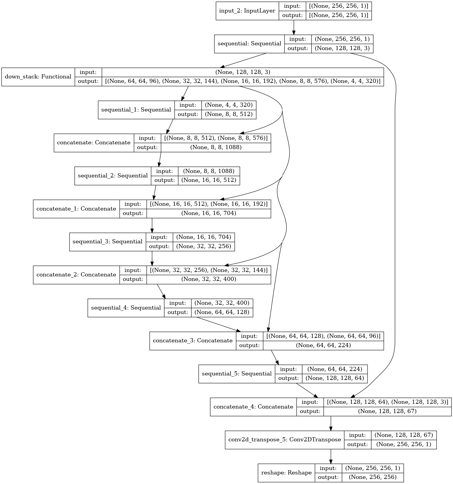

# Tangler

This project is inspired by physical [string art](https://vimeo.com/175653201), where you reproduce images using a sequence of overlapping strings.

The usual way to generate a pattern like that is with an incremental approach: start at some arbitrary pin, then add a single line at a time looking for the optimal next pin that gets your vector representation closer to the bitmap version. This works surprisingly well. I made a web app called [Raveler](https://jperryhouts.github.io/raveler/) that can convert any image into string art using that method.

That algorithm takes ~200 milliseconds in native C++, and I got it to around 600 milliseconds in the browser using a C++ to wasm/javascript compiler. I think it would be really cool to do this in real time with video or webcam input where 600ms per frame would be too slow. It seems like something a neural net would be really good at, since it's basically just a weird compression algorithm.

The goal of this project is to train a neural network that will be able to generate similar string art representations of arbitrary images in real time. My plan is to convert a bunch of random images into line paths using the iterative approach I mentioned before, and train a neural net to generate similar patterns, using the original bitmap images as examples.

## Challenges

This problem is not trivial, as the original algorithm is stochastic and quantized into discrete outputs (locations of pins around the circumference of the circle). Comparing the quality of one string path to another is challenging, and the fact that the problem is discretized means that there are no obvious derivatives that an iterative optimizer can follow to improve its results.

I’ve identified three basic approaches to handle this problem:

1. Match the exact pattern (e.g. pin 1, 10, 62, 76, 89, 1, ...).
    - This sort of works, but because the original algorithm is stochastic it doesn't do a very good job at generalizing. For instance, the above example would be exactly equivalent to traversing those  same nodes in the opposite direction. The original algorithm is highly sensitive to minor variations in the input, so it may very well take either route while the model has no way to know about that symmetry.
    - It isn’t good at comparing the similarity of two points, since it doesn’t know about the spatial wrap-around inherent in the problem -- pin K-1 is adjacent to pin 0 for a model with K pins. For instance, pin 1 is closer to pin 280 than it is to pin 150.
2. Encode the target pattern as a probability density with respect to the edges traversed, rather than the nodes. e.g. the above example would be encoded such that the edge between pin 1->10 is traversed once, as is the edge between 10->62, 62->76 etc. This allows the model to match string patterns independent of their particular sorting.
3. Some sort of recurrent network, where the sequence is built up incrementally, similar to the original algorithm.

I’m going to rule out approach 3 right away, because the whole point is to do the whole process in one-shot. Building a path incrementally is the starting point here, not the end goal. Approach 2 is more likely to generalize than approach 1, but it has several important drawbacks:

- It loses all information about the inherent symmetry and spatial layout of the problem. For instance, it can’t know that an edge from A-B is more similar to an edge from A-B+1 than A-B+100.
- It isn’t true to the original point of the exercise-- using one continuous string path.
- Rendering a few thousand separate lines is slower than rendering one long path
- The resulting model is big because it has O(K^2) output dimensions, where K is the number of pins around the circumference of the circle.

### Method

After much experimentation, the method I've adopted is most similar to option 2 above. I represent each target pattern as a 2D NxN matrix, where N is the number of points ("pins") around the circumfrence of a circle. Each row corresponds to a pin (`i`), and each column corresponds to another pin (`j`) to which pin `i` may or may not connect. That is, if `i` and `j` appear next to one another in the original string path, then row `i`/column `j` will contain a 1, otherwise it will contain a zero. Because of the model's inherent symmetry, the target matrix is also symmetric (equal to its own transpose).

**Note:** For consistency I will refer to the string path (e.g. `{2, 105, 10, 230, ...}`) as the "raveled" representation, and the 2D matrix form described above as the "tangled" representation. Model training requires first creating raveled representations of each image in the dataset, then converting each one to a tangled representation, and training a model to predict the tangled representation based on its corresponding original image.

My training pipeline looks something like the following:

```
-----------      -------------      -------------
|  Image  |  ->  |  Raveled  |  ->  |  Tangled  | --------
-----------      -------------      -------------        |
     |                                             -------------------------
     |                                             |  binary crossentropy  |
     |                                             -------------------------
     |            -----------     ----------------       |
     -----------> |  Model  |  -> |  Prediction  | -------
                  -----------     ----------------
```

Steps in the top row of the above diagram are computationally expensive, so they are calcualted once, and complete training examples are stored in tfrecord format for efficient model training. The data wrangling steps are described in detail in the [documentation](docs/data/README.md).

<a href="docs/model_arch.png">

</a>

## Data

I am currently using images from [Imagenette](https://github.com/fastai/imagenette), a subset of the Imagenet database. The labels are ignored, and targets are generated using the [Raveler](https://github.com/jperryhouts/raveler/) CLI app. Targets are then converted into the format described in the methods section above. For efficiency, a scaled and cropped grayscale version of each image is saved alongside its calculated target in a set of `.tfrecord` files.

All the preprocessing steps can be reproduced by installing [Raveler](https://github.com/jperryhouts/raveler/) and running Tangler in `prep` mode with the following options:

```
python3 tangler.py prep -r 150 -n 10 -J 4 -N 5000 -k 256 -c 60 imagenette/train tfrecords/train
python3 tangler.py prep -r 150 -n 10 -J 4 -N 5000 -k 256 -c 60 imagenette/val tfrecords/val
```

Preprocessed training data can be downloaded from the following urls:

[tangler_training_data.tar.gz](https://storage-9iudgkuqwurq6.s3-us-west-2.amazonaws.com/tangler_training_data_imagenette/tangler_training_data.tar.gz)  
[tangler_validation_data.tar.gz](https://storage-9iudgkuqwurq6.s3-us-west-2.amazonaws.com/tangler_training_data_imagenette/tangler_validation_data.tar.gz)

## (Preliminary) Results

This is still a prototype, and therefore the results are still pretty sketchy, but it's clearly moving in the right direction. The model was still converging when I stopped it training, so presumably it could have achieved near perfect accuracy if given enough training time. Note that for this example I was only calculating model loss on the training set, so these results may be over fit to that data.

The latest model can be downloaded [here](https://storage-9iudgkuqwurq6.s3-us-west-2.amazonaws.com/tangler_models/tangler_model_20210522-180656.tar.gz).


