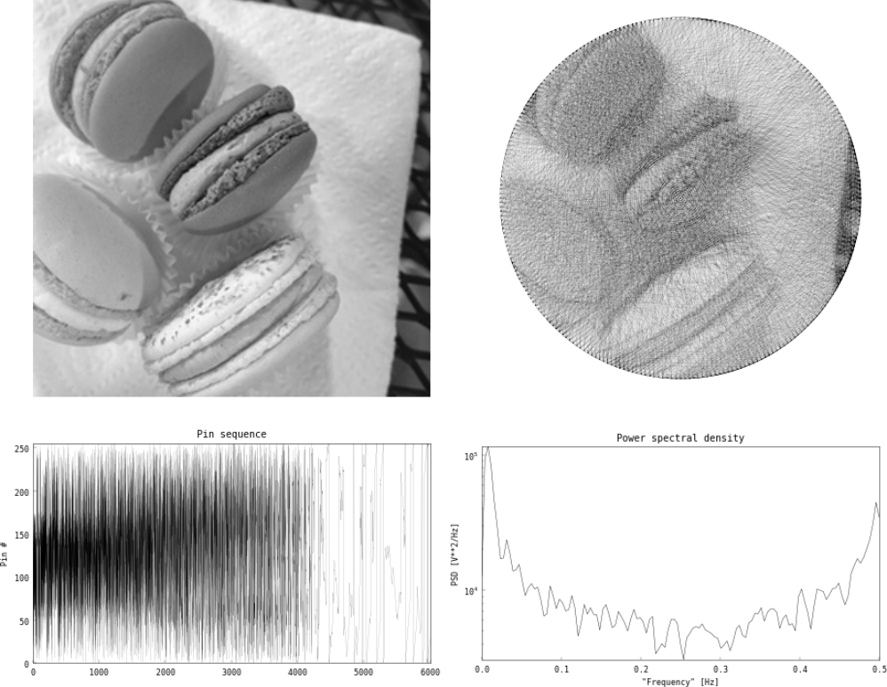
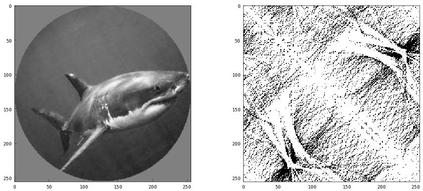
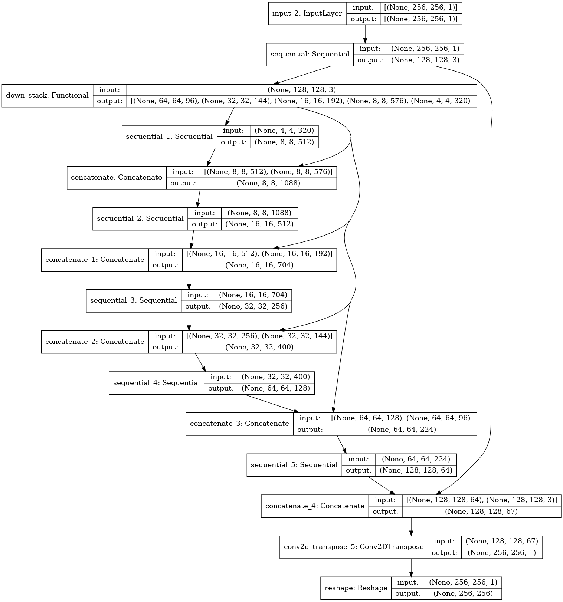

# Tangler

> Note: this document is still a rough draft. The final document will include a more thorough discussion of the results.

This project is inspired by physical [string art](https://vimeo.com/175653201), where you reproduce images using a sequence of overlapping strings.

The usual way to generate a pattern like that is with an incremental approach: start at some arbitrary pin, then evaluate the potential impact of drawing a line from that pin to each other pin- which one gets you closer to the original bitmap image? Add the optimal line, and repeat starting at your new pin. This works surprisingly well. I made a web app called [Raveler](https://jperryhouts.github.io/raveler/) that can convert any image into string art using that method. It will even assist in creating a physical string version of your design. That algorithm takes ~600 milliseconds in native C++, and around 1 second in the web app. The app is compiled to WASM bytecode using a C++ to wasm/javascript compiler.

I think it would be really cool to do this in real-time with video or webcam input, but the incremental algorithm would only be capable of about 1.5 frames per second. On the other hand, it seems like something a neural net would be able to do in a single pass, since it's basically just a weird compression algorithm.

The goal of this project is to train a neural network that will be able to generate similar string art representations of arbitrary images in real time. My plan is to convert a bunch of random images into line paths using the iterative "raveler" approach I mentioned before, and train a neural net to generate similar patterns.

## Challenges

This problem is not trivial, as the original algorithm is stochastic and quantized into discrete outputs (locations of pins around the circumference of the circle). Comparing the quality of predicted pin sequences is challenging, and the fact that the problem is discretized means that there are no obvious derivatives that an iterative optimizer can follow to improve its results.

I’ve identified three basic approaches to handle this problem:

1. Match the exact pattern (e.g. pin 1, 10, 62, 76, 89, 1, ...).
    - The original algorithm is stochastic, so it's nearly impossible for this method to generalize. For instance, the above example would be exactly equivalent to traversing those same nodes in the opposite direction, but the optimization algorithm for this method wouldn't know that.
    - It isn’t good at comparing the similarity of two points, since it doesn’t know about the spatial wrap-around inherent in the problem -- pin K-1 is adjacent to pin 0 for a model with K pins. For instance, pin 1 is closer to pin 280 than it is to pin 150.
    - There is not much uniquely identifiable information in the raw pin sequence (see figure 1)
2. Encode the target pattern as a probability density with respect to the edges traversed, rather than the nodes. e.g. the above example would be encoded such that the edge between pin 1->10 is traversed once, as is the edge between 10->62, 62->76 etc. This allows the model to match string patterns independent of their particular sorting.
3. Some sort of recurrent network, where the sequence is built up incrementally, similar to the original algorithm.

> 
>
> Figure 1. The raw pin sequence contains very little identifiable structure. The power spectral density plot (lower right) shows that the signal is nearly indistinguishable from white noise (it's actually purple noise, because of the peaks at both ends of the spectrum).

I’m going to rule out approach 3 right away, because the whole point is to do the whole process in one-shot. Building a path incrementally is the starting point here, not the end goal. Approach 2 is more likely to generalize than approach 1, so it's the one that I'll be focusing on here.

### Method

After much experimentation, the method I've adopted is most similar to option 2 above. I represent each target pattern as a 2D NxN matrix, where N is the number of points ("pins") around the circumfrence of a circle. Each row corresponds to a pin (`i`), and each column corresponds to another pin (`j`) to which pin `i` may or may not connect. That is, if `i` and `j` appear next to one another in the original "raveled" string path, then the target matrix will contain a 1 at row `i`/column `j`, all other elements in the target matrix contain zeros.

**Note:** For consistency I will refer to the string path (e.g. `{2, 105, 10, 230, ...}`) as the "raveled" representation, and the 2D matrix form described above as the "tangled" representation. Model training requires first creating raveled representations of each image in the dataset, then converting each one to a tangled representation, and training a model to predict the tangled representation based on its corresponding original image.

There are several important symmetries in the "tangled" representation:

- First, and most importantly, proximity in tangled space corresponds to similarity of visual fit in the rendered output. For example, a string from pin `a` to `b` is visually similar to a string from pin `a` to `b+1`, and the two pin pairs appear adjacent to one another in the tangled representation.
- Because of the raveled representation is symmetric with respect to direction (a string from a->b is the same as a pin from b->a), the tangled matrix is symmetric (equal to its own transpose).
- And lastly, because pin 0 is adjacent to pin 255, the left side of the tangled matrix is conceptually "adjacent" to the right side. Similarly, the top of the tangled matrix is "adjacent" to the bottom. The tangled space therefore has a toroidal topology, which makes data augmentation via rotation very efficient (the tangled matrix only needs to be "rolled" diagonally to effectively rotate the resulting image).

> 
>
> Figure 2. Example of a "tangled" representation (right). Each element in the tangled matrix (row i, column j) corresponds to a pin combination (pin i to pin j). A black pixel indicates that pin i and j should be connected by the raveled string path, while a white pixel indicates that the two are not connected.

My training pipeline looks something like the following:

```text
   ----------
   |  Image |
   ----------
       |
----------------      -------------      -------------
|  Normalized  |  ->  |  Raveled  |  ->  |  Tangled  | --------
----------------      -------------      -------------        |
       |                                             -------------------------
       |                                             |  binary crossentropy  |
       |                                             -------------------------
       |              -----------     ----------------       |
       -------------> |  Model  |  -> |  Prediction  | -------
                      -----------     ----------------
```

Steps in the top row of the above diagram are computationally expensive, so they are calcualted once, and complete training examples are stored in tfrecord format for efficient model training.

The model itself is arranged in a U-Net architecture, based on a pre-trained MobileNetV2 model, similar to that used in the TensorFlow [image segmentation tutorial](https://www.tensorflow.org/tutorials/images/segmentation?hl=nb).



I found that transfer learning from the pretrained model helps, but is most effective if all layers are trainable. This is in contrast to the conventional wisdom about transfer learning that the pre-trained layers should be locked, at least until a final fine-tuning step.

## Data

My itinial attempts at this model were all trained on [Imagenette](https://github.com/fastai/imagenette), a small (~10,000 image) subset of the Imagenet database. Once I started to see promising convergence behavior I scaled up to data from the [ImageNet object localization challenge](https://www.kaggle.com/c/imagenet-object-localization-challenge/data). Complete details on data wrangling steps, and links to download the preprocessed data can be found in the [documentation](DATA.md).

## Results

The animation below demonstrates the algorithm's effictiveness against some stock video footage. The algorithm is able to convert about 15 frames per second. The video below is running at 30 frames per second (approximately equivalent to dropping every other frame).

https://user-images.githubusercontent.com/6118266/123179136-930b0a80-d43d-11eb-972a-e515f7eef12d.mp4

[Full demo video](https://storage-9iudgkuqwurq6.s3-us-west-2.amazonaws.com/tangler_480.mp4) \[shark content from [Discovery UK](https://www.youtube.com/watch?v=pgYmY6--DjI)\]

<!--<video width="1280" height="720" autoplay=true loop=true controls=false>
<source src="https://storage-9iudgkuqwurq6.s3-us-west-2.amazonaws.com/tangler_720.mp4" type="video/mp4">
</video>-->

Qualitatively, it appears that while the algorithm does a good job at recreating shapes and light/dark regions of the images, it seems to lose some definition around sharp edges. Most objects appear a little blurrier with this algorithm than they would using the original incremental approach.
